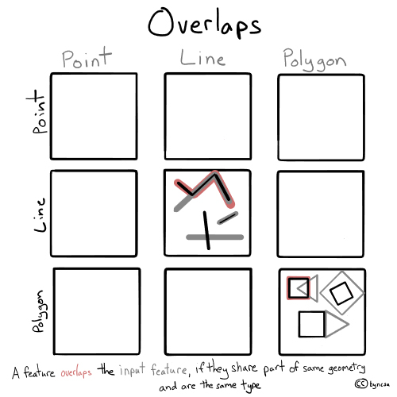
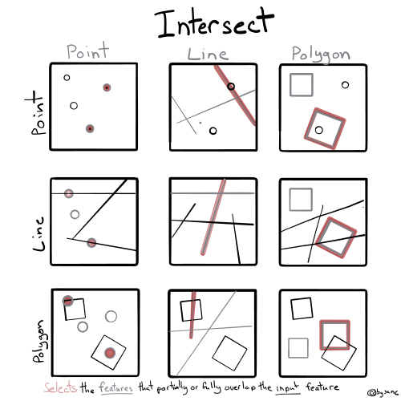
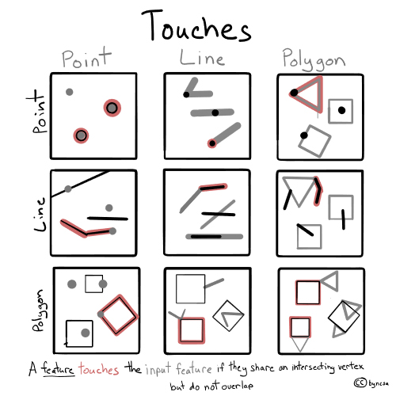
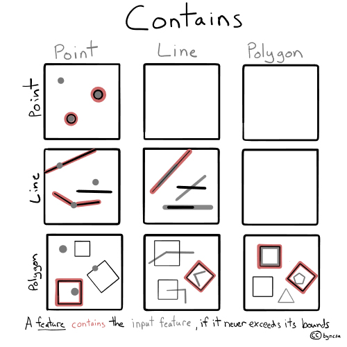
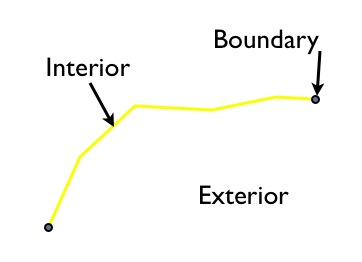
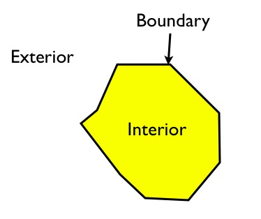
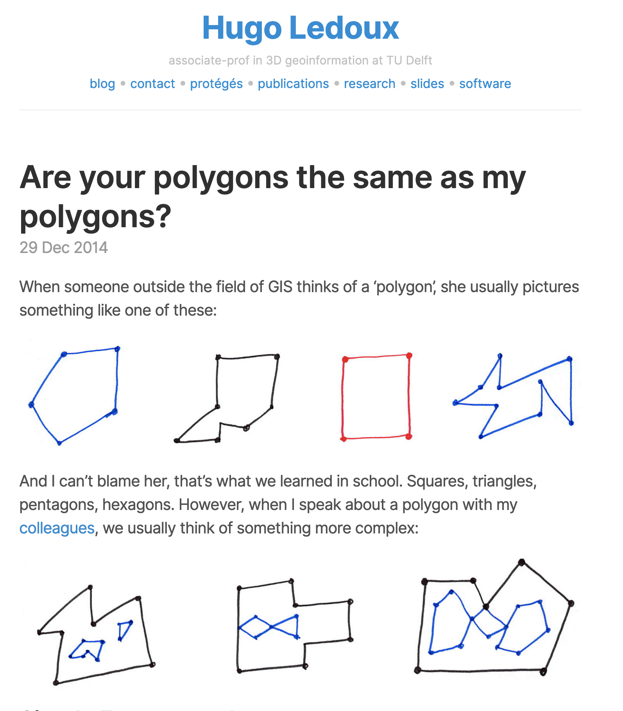
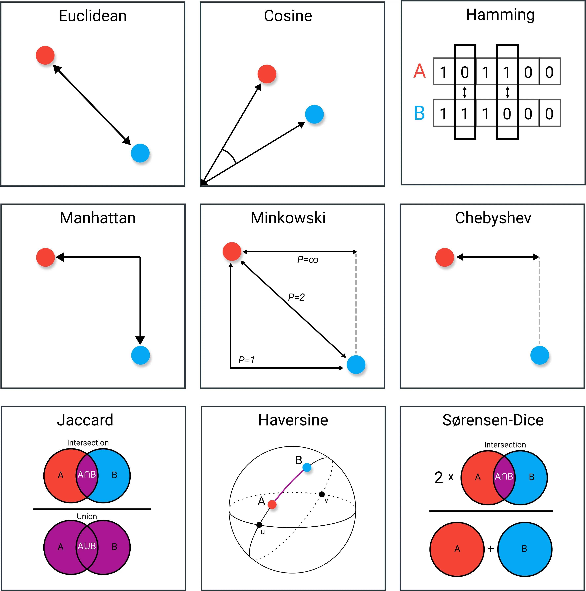

## Recap from last week

```{r echo=FALSE, message=FALSE, warning=FALSE}
opts <- options(knitr.kable.NA = "")
library(knitr)
library(kableExtra)
hook_output <- knit_hooks$get("output")
knit_hooks$set(output = function(x, options) {
  lines <- options$output.lines
  if (is.null(lines)) {
    return(hook_output(x, options))  # pass to default hook
  }
  x <- unlist(strsplit(x, "\n"))
  more <- "..."
  if (length(lines)==1) {        # first n lines
    if (length(x) > lines) {
      # truncate the output, but add ....
      x <- c(head(x, lines), more)
    }
  } else {
    x <- c(more, x[lines], more)
  }
  # paste these lines together
  x <- paste(c(x, ""), collapse = "\n")
  hook_output(x, options)
})


library(tidyverse)
library(here)
library(sf)

sm_tbl <-
    here("data", "processed", "smartcard_20150401_subway.csv") %>%
    read_csv()

distr_sf <-
    here("data", "raw", "subway_smartcard", "districts.shp") %>%
    st_read()
```

-   Reconceptualising space
-   Spatial data types
-   Converting and casting
-   Visualising spatial data
-   Reading & writing external files

## Today's plan

## `filter` again

```{r}
#| eval: false

library(tidyverse)
library(here)

sm_tbl <-
    here("data", "processed", "smartcard_20150401_subway.csv") %>%
    read_csv()

sm_tbl %>%
    filter(station_name_O %in%  c("星中路", "南京东路"))

 
```

::: {style="font-size: 0.45em"}
```{r}
#| echo: false

library(tidyverse)
library(here)
library(kableExtra)

sm_tbl <-
    here("data", "processed", "smartcard_20150401_subway.csv") %>%
    read_csv()

sm_tbl %>% 
    filter(station_name_O %in%  c("星中路", "南京东路")) %>%
    head(5) %>%
    kable() %>%
    kable_styling(bootstrap_options = 'condensed') %>%
    column_spec(4, background = 'green')
    

```
:::

## Breaking it down. What's happening with `%in%`?

```{r}
sm_tbl$station_name_O %in% c("星中路", "南京东路")
```

## Breaking it down. What's happening with filter?

```{r}
#| eval: false

sm_tbl %>%
    filter(c(TRUE, FALSE, FALSE, TRUE, ...))
```

::: {style="font-size: 0.45em"}
```{r}
#| echo: false

sm_tbl %>%
    head(5) %>%
    kable() %>%
    kable_styling(bootstrap_options = 'condensed') %>%
    row_spec(2:3, strikeout = T)
```

::: fragment
```{r}
#| echo: false

sm_tbl %>% 
    filter(station_name_O %in%  c("星中路", "南京东路")) %>%
    head(5) %>%
    kable() %>%
    kable_styling(bootstrap_options = 'condensed')
```
:::
:::

## Same thing with spatial relationships

```{r}
#| eval: false

library(sf)

scard_sf <- 
    sm_tbl %>%
    st_as_sf(coords = c("lon_D", "lat_D"), crs = 4326) 

center_pt <- 
    st_point(c(121.469170, 31.224361)) %>% 
    st_sfc(crs=4326)

scard_sf %>%
    filter(st_distance(., center_pt)[,1]< units::set_units(4, "km"))
```

::: fragment
::: {style="font-size: 0.45em"}
```{r}
#| echo: false

library(sf)

scard_sf <- sm_tbl %>%
    st_as_sf(coords = c("lon_D", "lat_D"), crs = 4326) 

center_pt <- st_point(c(121.469170, 31.224361)) %>% st_sfc(crs=4326)

scard_sf %>%
    head(10) %>%
    filter(st_distance(., center_pt)[,1] < units::set_units(4, "km")) %>%
    head(5) %>%
    kable() %>%
    kable_styling(bootstrap_options = 'condensed') 
   
```
:::
:::

## Let's break it down!

::: fragment
```{r}
#| output-location: column-fragment
units::set_units(4, "km")
```
:::

::: fragment
```{r}
#| output-location: column-fragment

scard_sf %>%
    head(5)%>%
    st_distance(.,center_pt)
```
:::

::: fragment
```{r}
#| output-location: column-fragment

st_distance(scard_sf[1:5,],center_pt)[,1] < units::set_units(4, "km")
```
:::

## Other spatial relationships

```{r}
#| eval: false
#| code-line-numbers: "7"

distr_sf <-
    here("data", "raw", "subway_smartcard", "districts.shp") %>%
    st_read()

scard_sf %>%
    filter(
        st_within(., distr_sf %>% filter(district == "嘉定区"), sparse = F)[,1]
    )
    
```

::: {style="font-size: 0.7em"}
```{r}
#| echo: false

dist1 <- distr_sf %>% filter(district == "嘉定区")

scard_sf %>% 
    head(100) %>%
    filter(
        st_within(., dist1 , sparse = F)[,1]
    ) %>%
    kable() %>%
    kable_styling(bootstrap_options = "condensed")
```
:::

## Spatial Relationships

{fig-align="center"}

::: {style="font-size: 0.3em"}
Source: Michael Mann, Steven Chao, Jordan Graesser, Nina Feldman, https://pygis.io/docs/e_spatial_joins.html
:::

## Spatial Relationships

{fig-align="center"}

::: {style="font-size: 0.3em"}
Source: Michael Mann, Steven Chao, Jordan Graesser, Nina Feldman, https://pygis.io/docs/e_spatial_joins.html
:::

## Spatial Relationships

{fig-align="center"}

::: {style="font-size: 0.3em"}
Source: Michael Mann, Steven Chao, Jordan Graesser, Nina Feldman, https://pygis.io/docs/e_spatial_joins.html
:::

## Spatial Relationships

{fig-align="center"}

::: {style="font-size: 0.3em"}
Source: Michael Mann, Steven Chao, Jordan Graesser, Nina Feldman, https://pygis.io/docs/e_spatial_joins.html
:::

## Spatial Relationships

{fig-align="center"}

::: {style="font-size: 0.3em"}
Source: Michael Mann, Steven Chao, Jordan Graesser, Nina Feldman, https://pygis.io/docs/e_spatial_joins.html
:::

## Spatial Relationships

{fig-align="center"}

::: {style="font-size: 0.3em"}
Source: Michael Mann, Steven Chao, Jordan Graesser, Nina Feldman, https://pygis.io/docs/e_spatial_joins.html
:::

## Dimensionally Extended 9-Intersection Model (DE-9IM)


::: {layout-ncol="2"}
::: {layout-nrow="2"}
{fig-align="center" height="200"}
{fig-align="center" height="200"}
:::

{fig-align="center" height = "400"}
:::

::: {style="font-size: 0.3em"}
Source: Paul Ramsey & Mark Leslie, https://postgis.net/workshops/postgis-intro/de9im.html
:::


## Using DE-9IM for filters

```{r}
#| eval: false
scard_sf %>%
    filter(
        st_relate(., 
                  distr_sf %>% filter(district == "嘉定区"), 
                  pattern = "T*F**F***",
                  sparse = F)[,1]
    )


```

is same as

```{r}
#| eval: false
scard_sf %>%
    filter(
        st_within(., 
                  distr_sf %>% filter(district == "嘉定区"), 
                  sparse = F)[,1]
    )
```

but can do lot more!

## Using DE-9IM for filters

{width="459"}

For Inside & touching use (treatment)

```{r}
#| eval: false
#| 
st_relate(A, B, pattern = "T*F*TF***")
```

For outside & touching use (control)

```{r}
#| eval: false
st_relate(A, B, pattern = "F*T*T****")
```

## When  `within`  is not  `within`

 

::: {style="font-size: 0.3em"} https://twitter.com/RhoBott/status/788810834747154432/photo/1
:::


## Rethink polygons (digression)

 
## Invalid polygons (digression)

 
::: {style="font-size: 0.3em"} 
Source: Hugo Ledoux
:::


## Distances


## Different types of distances

 
::: {style="font-size: 0.3em"} 
Source: Maarten Grootendorst
:::

## What is a neighborhood?

Often defined with a spatial relationship

- Distance $< D$
- Touches $==TRUE$
- Intersect $==TRUE$
...

Or combinations e such as

- Distance $<D$ `&` Touches $==TRUE$

...


## Rethinking joins

{height="250"} {height="250"} {height="250"}

-   Join on any column including
    -   number
    -   name/string
    -   date/time
    -   **geometry**
-   Joining is fundamentally filtering and matching together.


# Other spatial operations


# Thank you
