```{r include=FALSE}
opts <- options(knitr.kable.NA = "")
library(knitr)
library(kableExtra)
library(tidyverse)
library(here)


hook_output <- knit_hooks$get("output")
knit_hooks$set(output = function(x, options) {
  lines <- options$output.lines
  if (is.null(lines)) {
    return(hook_output(x, options))  # pass to default hook
  }
  x <- unlist(strsplit(x, "\n"))
  more <- "..."
  if (length(lines)==1) {        # first n lines
    if (length(x) > lines) {
      # truncate the output, but add ....
      x <- c(head(x, lines), more)
    }
  } else {
    x <- c(more, x[lines], more)
  }
  # paste these lines together
  x <- paste(c(x, ""), collapse = "\n")
  hook_output(x, options)
})


library(tidyverse)
library(here)
library(sf)

sm_tbl <-
    here("data", "processed", "smartcard_20150401_subway.csv") %>%
    read_csv()

distr_sf <-
    here("data", "raw", "subway_smartcard", "districts.shp") %>%
    st_read()


```

## Recap from last week

-   Reconceptualising space
-   Spatial data types
-   Converting and casting
-   Visualising spatial data
-   Reading & writing external files


## A reminder about the data

```{r}

sm_tbl %>%
    head(5)

distr_sf %>%
    head(5)
```

## A reminder about the data

```{r}
#| eval: false

subway_stations <- 
    here("data", "raw", "subway_smartcard", "SUB_Station.csv") %>%
    read_csv() %>%
    rename(Station="站点",
           Route="所属线路",
           District="所属区划") %>%
    select("Station", "District")

sm_tbl_2 <- sm_tbl%>%
      left_join(subway_stations, 
                by = c("station_name_D" = "Station")
                ) %>%
      rename(Dist_dest = "District") %>%
            left_join(subway_stations, 
                by = c("station_name_O" = "Station")
                ) %>%
      rename(Dist_origin = "District")
    
```

::: {style="font-size: 0.3em"}
```{r}
#| echo: false

subway_stations <- 
    here("data", "raw", "subway_smartcard", "SUB_Station.csv") %>%
    read_csv() %>%
    rename(Station="站点",
           Route="所属线路",
           District="所属区划") %>%
    select("Station", "District")

sm_tbl_2 <- sm_tbl%>%
      left_join(subway_stations, 
                by = c("station_name_D" = "Station")
                ) %>%
      rename(Dist_dest = "District") %>%
            left_join(subway_stations, 
                by = c("station_name_O" = "Station")
                ) %>%
      rename(Dist_origin = "District")

sm_tbl_2 %>%
    head(3) %>%
    kable() %>%
    kable_styling(bootstrap_options = 'condensed') 
    
    
```
:::

## Recap

```{r}
#| output-location: column-fragment


library(tmap)
tmap_mode("view")

sm_tbl_2 %>%
    group_by(Dist_origin) %>%
    summarise(numtrips = n()) %>%
    inner_join(distr_sf, 
               by=c("Dist_origin" = "district")) %>%
    st_as_sf(crs = 4326) %>%
    tm_shape()+
    tm_fill(col = "numtrips", 
            palette = "-viridis", 
            type = "seq",
            style = "quantile")


```

## Recap

```{r}
#| code-fold: true


tmap_mode("plot")

sm_tbl_2 %>%
    mutate(hr = hour(dat_time_O),
           time_of_day = hr %>% 
               cut(breaks=c(0,6,10,16,20,24), include.lowest = TRUE, 
                   labels=c("Midnight - 6AM", 
                            "6AM - 10AM", 
                            "10AM - 4PM", 
                            "4PM - 8PM", 
                            "8PM - Midnight"))
    ) %>%
group_by(Dist_origin, time_of_day) %>%
    summarise(numtrips = n()) %>%
    inner_join(distr_sf, by=c("Dist_origin" = "district")) %>%
    st_as_sf(crs = 4326) %>%
    tm_shape()+
    tm_fill(col = "numtrips", 
            palette = "-viridis", 
            type = "seq",
            style = "quantile") +
    tm_facets(by = "time_of_day")

```

## Today's plan

- Understanding spatial relationships
- DE-9IM
- Space as a graph
- Other geometric operations
- Further Work

## `filter` again

```{r}
#| eval: false

sm_tbl %>%
    filter(station_name_O %in%  c("星中路", "南京东路"))
```

::: {style="font-size: 0.45em"}
```{r}
#| echo: false

sm_tbl %>% 
    filter(station_name_O %in%  c("星中路", "南京东路")) %>%
    head(5) %>%
    kable() %>%
    kable_styling(bootstrap_options = 'condensed') %>%
    column_spec(4, background = 'green')
    

```
:::

## Breaking it down. What's happening with `%in%`?

```{r}
#| output.lines = 4


sm_tbl$station_name_O %in% c("星中路", "南京东路")
```

## Breaking it down. What's happening with filter?

```{r}
#| eval: false

sm_tbl %>%
    filter(c(TRUE, FALSE, FALSE, TRUE, ...))
```

::: {style="font-size: 0.45em"}
```{r}
#| echo: false

sm_tbl %>%
    head(5) %>%
    kable() %>%
    kable_styling(bootstrap_options = 'condensed') %>%
    row_spec(2:3, strikeout = T, background = "yellow")
```

::: fragment
```{r}
#| echo: false

sm_tbl %>% 
    filter(station_name_O %in%  c("星中路", "南京东路")) %>%
    head(5) %>%
    kable() %>%
    kable_styling(bootstrap_options = 'condensed')
```
:::
:::

## Same thing with spatial relationships

```{r}
#| eval: false

library(sf)

scard_sf <- 
    sm_tbl %>%
    st_as_sf(coords = c("lon_D", "lat_D"), crs = 4326) 

center_pt <- 
    st_point(c(121.469170, 31.224361)) %>% 
    st_sfc(crs=4326)

scard_sf %>%
    filter(st_distance(., center_pt)[,1]< units::set_units(4, "km"))
```

::: fragment
::: {style="font-size: 0.45em"}
```{r}
#| echo: false

library(sf)

scard_sf <- sm_tbl %>%
    st_as_sf(coords = c("lon_D", "lat_D"), crs = 4326) 

center_pt <- st_point(c(121.469170, 31.224361)) %>% st_sfc(crs=4326)

scard_sf %>%
    head(10) %>%
    filter(st_distance(., center_pt)[,1] < units::set_units(4, "km")) %>%
    head(5) %>%
    kable() %>%
    kable_styling(bootstrap_options = 'condensed') 
   
```
:::
:::

## Let's break it down!

::: fragment
```{r}
#| output-location: column-fragment
units::set_units(4, "km")
```
:::

::: fragment
```{r}
#| output-location: column-fragment

scard_sf %>%
    head(5)%>%
    st_distance(.,center_pt)
```
:::

::: fragment
```{r}
#| output-location: column-fragment

st_distance(scard_sf[1:5,],center_pt)[,1] < units::set_units(4, "km")
```
:::

::: fragment
```{r}
#| eval: false

scard_sf %>%
    filter(st_distance(., center_pt)[,1]< units::set_units(4, "km"))
```

::: {style="font-size: 0.30em"}
```{r}
#| echo: false
#| output-location: column-fragment

scard_sf %>%
    head(10) %>%
    filter(st_distance(., center_pt)[,1] < units::set_units(4, "km")) %>%
    head(3) %>%
    kable() %>%
    kable_styling(bootstrap_options = 'condensed') 
   
```
:::
:::

## Other spatial relationships

```{r}
#| eval: false
#| code-line-numbers: "7"

distr_sf <-
    here("data", "raw", "subway_smartcard", "districts.shp") %>%
    st_read()

scard_sf %>%
    filter(
        st_within(., distr_sf %>% filter(district == "嘉定区"), sparse = F)[,1]
    )
    
```

::: {style="font-size: 0.5em"}
```{r}
#| echo: false

dist1 <- distr_sf %>% filter(district == "嘉定区")

scard_sf %>% 
    head(100) %>%
    filter(
        st_within(., dist1 , sparse = F)[,1]
    ) %>%
    kable() %>%
    kable_styling(bootstrap_options = "condensed")
```
:::

## Spatial Relationships

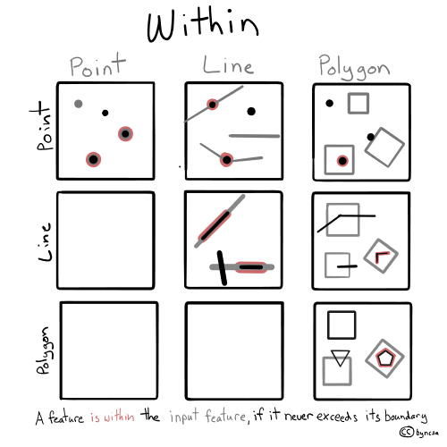{fig-align="center"}

::: {style="font-size: 0.3em"}
Source: Michael Mann, Steven Chao, Jordan Graesser, Nina Feldman, https://pygis.io/docs/e_spatial_joins.html
:::

## Spatial Relationships

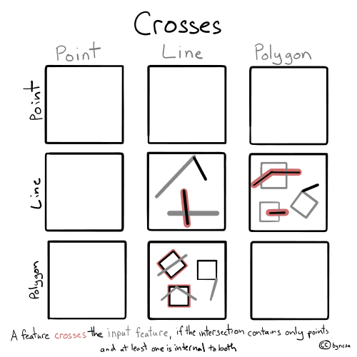{fig-align="center"}

::: {style="font-size: 0.3em"}
Source: Michael Mann, Steven Chao, Jordan Graesser, Nina Feldman, https://pygis.io/docs/e_spatial_joins.html
:::

## Spatial Relationships

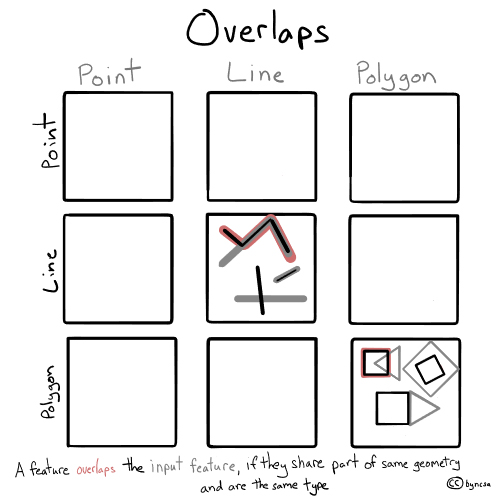{fig-align="center"}

::: {style="font-size: 0.3em"}
Source: Michael Mann, Steven Chao, Jordan Graesser, Nina Feldman, https://pygis.io/docs/e_spatial_joins.html
:::

## Spatial Relationships

{fig-align="center"}

::: {style="font-size: 0.3em"}
Source: Michael Mann, Steven Chao, Jordan Graesser, Nina Feldman, https://pygis.io/docs/e_spatial_joins.html
:::

## Spatial Relationships

{fig-align="center"}

::: {style="font-size: 0.3em"}
Source: Michael Mann, Steven Chao, Jordan Graesser, Nina Feldman, https://pygis.io/docs/e_spatial_joins.html
:::

## Spatial Relationships

{fig-align="center"}

::: {style="font-size: 0.3em"}
Source: Michael Mann, Steven Chao, Jordan Graesser, Nina Feldman, https://pygis.io/docs/e_spatial_joins.html
:::

## Dimensionally Extended 9-Intersection Model (DE-9IM)


::: {layout-nrow="2"}
{fig-align="center" height="200"} {fig-align="center" height="200"}

:::

::: {style="font-size: 0.3em"}
Source: Paul Ramsey & Mark Leslie, https://postgis.net/workshops/postgis-intro/de9im.html
:::

## Using DE-9IM for filters

```{r}
#| eval: false
scard_sf %>%
    filter(
        st_relate(., 
                  distr_sf %>% filter(district == "嘉定区"), 
                  pattern = "T*F**F***",
                  sparse = F)[,1]
    )


```

is same as

```{r}
#| eval: false
scard_sf %>%
    filter(
        st_within(., 
                  distr_sf %>% filter(district == "嘉定区"), 
                  sparse = F)[,1]
    )
```

but can do lot more!

## Using DE-9IM for filters

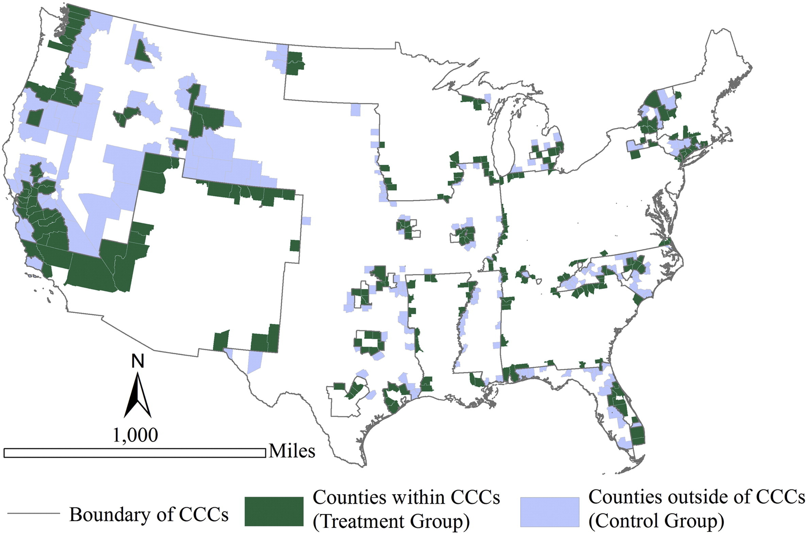{fig-align="center"}

Treatment: Inside & touching

```{r}
#| eval: false

st_relate(A, B, pattern = "T*F*TF***")
```

Control: Outside & touching

```{r}
#| eval: false
st_relate(A, B, pattern = "F*T*T****")
```

## When `within` is not `within`

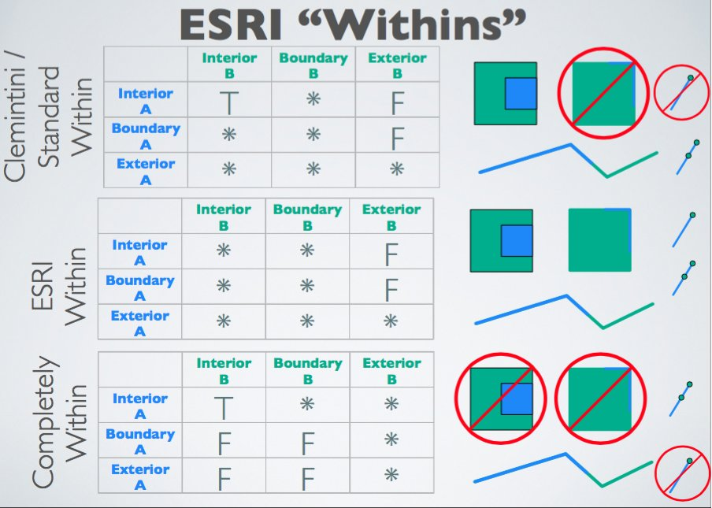{fig-align="center" width="900"}

::: {style="font-size: 0.3em"}
https://twitter.com/RhoBott/status/788810834747154432/photo/1
:::

## Rethink polygons (digression)

{fig-align="center" width="900"}

## Invalid polygons (digression)

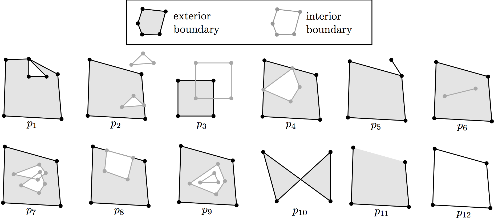{fig-align="center"}

::: {style="font-size: 0.3em"}
Source: Hugo Ledoux
:::

Try and make them valid with `st_make_valid`

## Sometimes simple is better

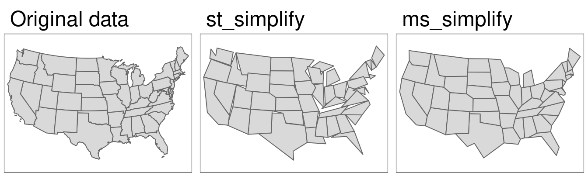

::: {style="font-size: 0.3em"}
Source: Robin Lovelace, Jakub Nowosad, Jannes Muenchow
:::

## Different types of distances

{width="793" fig-align="center"}

::: {style="font-size: 0.3em"}
Source: Maarten Grootendorst
:::

## Distances depend on crs

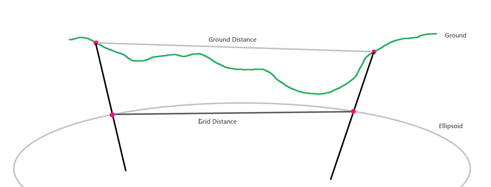{width="789"} 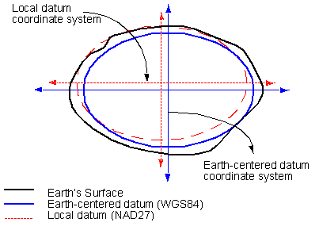{width="417"}

## EPSG (www.epsg.io)

::: {layout-ncol="3"}
{width="300"} {width="300"} {width="300"}
:::

## Transform the geometry

```{r}
#| eval: false
distr_sf_transform <-
    st_transform(distr_sf, 32651)

st_distance(distr_sf_transform)

```

::: columns
::: {.column width="50%"}
::: {style="font-size: 0.5em"}
```{r}
#| echo: false

tmap_mode("plot")

distr_sf_transform <-
    st_transform(distr_sf, 32651) # UTM 51N projected crs


distr_sf %>%
    head(5) %>%
    select(geometry) %>%
    kable() %>%
    kable_styling(bootstrap_options = 'condensed')

st_distance(distr_sf[1:7,])

```
:::
:::

::: {.column width="50%"}
::: {style="font-size: 0.5em"}
```{r}
#| echo: false

distr_sf_transform %>%
    head(5) %>%
    select(geometry) %>%
    kable() %>%
    kable_styling(bootstrap_options = 'condensed')

st_distance(distr_sf_transform[1:7,],)

```
:::
:::
:::

## What is a neighborhood?

Often defined with a spatial relationship

-   Distance $< D$
-   Touches $==TRUE$
-   Intersects $==TRUE$

...

Or combinations such as

-   Distance $<D$ `&` Touches $==TRUE$
-   Distance $<D$ `|` Touches $==TRUE$

...


## Neighbors

```{r}
#| eval: false
library(spdep)

nb_matrix <- poly2nb(distr_sf_transform) %>%
                nb2mat(zero.policy = T, style = "B")

```

```{r}
#| echo: false
library(spdep)

nb_matrix <- poly2nb(distr_sf_transform) 

plot(st_geometry(distr_sf_transform), border="grey60")
plot(nb_matrix, st_coordinates(st_centroid(distr_sf_transform)), add=TRUE, pch=19, cex=0.6)


```

## Neighborhood adjacency matrix

```{r}
#| code-fold: true

#create unique district ids
distr_sf_transform$id_val <- paste0("D", 1:nrow(distr_sf_transform))

sm_tbl_3 <- sm_tbl_2 %>%
group_by(Dist_origin) %>%
    summarise(numtrips = n()) %>%
    inner_join(distr_sf_transform, by=c("Dist_origin" = "district")) 
    
nb_matrix <- poly2nb(distr_sf_transform, queen = F) %>%
                nb2mat(zero.policy = T, style = "B")

row.names(nb_matrix) <- colnames(nb_matrix) <- distr_sf_transform$id_val

# rearrange the nb_matrix rows and columns to match the order of district ids in sm_tbl_3
nb_matrix <-
    nb_matrix[sm_tbl_3$id_val,sm_tbl_3$id_val]

sm_tbl_3 <- sm_tbl_3 %>%
    mutate(Neigh_numtrips = nb_matrix %*% numtrips)

```

::: {style="font-size: 0.8em"}
```{r}
#| echo: false

sm_tbl_3 %>%
    select(Dist_origin, numtrips, Neigh_numtrips) %>%
    head(4) %>%
        kable() %>%
        kable_styling(bootstrap_options = 'condensed')

```
:::

## Rethinking joins

::: {.content-hidden when-format="pdf"}

{width="300"} {width="300"} {width="300"}

:::

::: {style="font-size: 0.8em"}
-   Join on any column including
    -   number
    -   name/string
    -   date/time
    -   **geometry**
-   Joining is fundamentally filtering and matching together

:::

# Other geometric operations

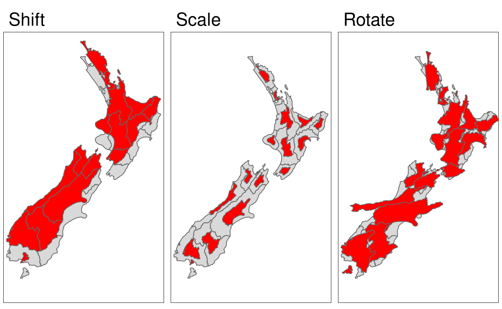

::: {style="font-size: 0.3em"}
Source: Robin Lovelace, Jakub Nowosad, Jannes Muenchow
:::

# Other geometric operations

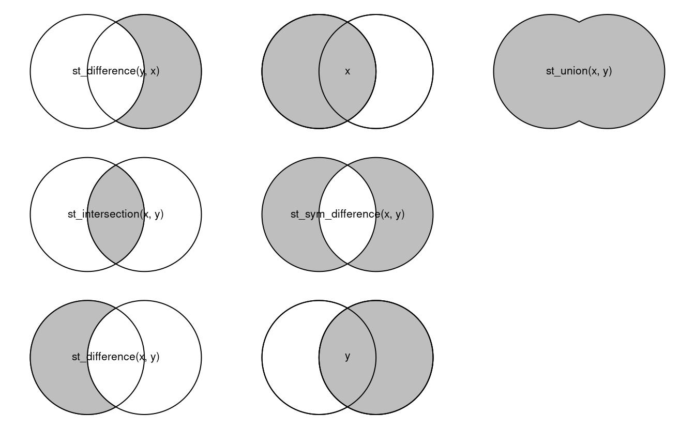

::: {style="font-size: 0.3em"}
Source: Robin Lovelace, Jakub Nowosad, Jannes Muenchow
:::

## Conclusions: Spatial is `somewhat` special


- Learn to think about spatial objects without plotting
- Topological relationships are not embedded in simple features. They have to be inferred
- Pay attention to units, especially for distance/areas
- Pay attention to coordinate systems


## Thank you
